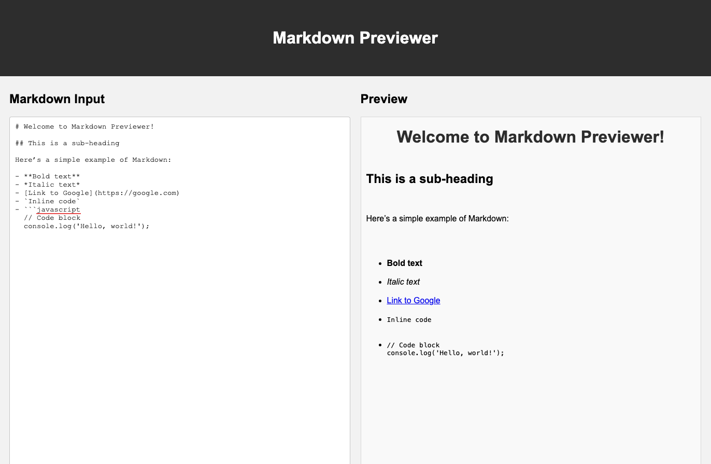

# Markdown Previewer



Welcome to the Markdown Previewer! This simple web application allows you to write and preview Markdown in real-time. It’s built using React and Vite, providing a fast and modern development experience.

## Table of Contents

- [Features](#features)
- [Demo](#demo)
- [Installation](#installation)
- [Usage](#usage)
- [Technologies Used](#technologies-used)
- [Contributing](#contributing)
- [License](#license)
- [Acknowledgements](#acknowledgements)

## Features

- **Real-time Markdown Preview:** See your Markdown rendered as HTML as you type.
- **Clean and Simple UI:** A minimalistic design that focuses on usability and functionality.
- **Responsive Design:** Works well on both desktop and mobile devices.
- **Markdown Syntax Support:** Supports common Markdown syntax, including headings, lists, links, images, and code blocks.

## Demo

You can try the Markdown Previewer live at [GitHub Pages](#) or [Vercel](#) (replace with your deployment link).

## Installation

To run this project locally, follow these steps:

1. **Clone the repository:**

    ```bash
    git clone https://github.com/yourusername/markdown-previewer.git
    cd markdown-previewer
    ```

2. **Install dependencies:**

    ```bash
    npm install
    ```

3. **Run the development server:**

    ```bash
    npm run dev
    ```

4. Open your browser and navigate to `http://localhost:5173/`.

## Usage

- **Markdown Input:** Type your Markdown in the left-hand editor.
- **Preview:** The right-hand pane shows the rendered HTML output.
- **Modify:** Make changes to your Markdown and see the preview update in real-time.

### Markdown Example

You can try pasting the following Markdown into the editor to see how it works:

  ```markdown
  # Welcome to Markdown Previewer!

  ## This is a sub-heading

  Here’s a simple example of Markdown:

  - **Bold text**
  - *Italic text*
  - [Link to Google](https://google.com)
  - `Inline code`
  - ```javascript
    // Code block
    console.log('Hello, world!');
  ```

## Technologies Used

- **React:** A JavaScript library for building user interfaces.
- **Vite:** A fast build tool and development server.
- **Marked:** A Markdown parser and compiler for converting Markdown into HTML.
- **CSS:** Simple, responsive styling.

## Contributing

Contributions are welcome! If you have ideas for new features, feel free to fork the repository and submit a pull request. Please make sure your code follows the existing style and passes any linting checks.

### Steps to Contribute:

1. Fork the repository.
2. Create a new branch (`git checkout -b feature-branch`).
3. Make your changes.
4. Commit your changes (`git commit -m 'Add some feature'`).
5. Push to the branch (`git push origin feature-branch`).
6. Open a pull request.

## License

This project is licensed under the MIT License. See the [LICENSE](LICENSE) file for more details.

## Acknowledgements

- [Marked](https://github.com/markedjs/marked) - Markdown parser used in this project.
- [Vite](https://vitejs.dev/) - Fast build tool and development server.
- [React](https://reactjs.org/) - JavaScript library for building user interfaces.
